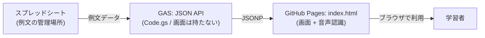

# English Training

よく使う英語表現を「口が勝手に動く」レベルまで反復するための、自作の音読練習Webアプリ。
自分に必要な例文だけをスプレッドシートにためて、日本語を見て英語を思い出すクイズ形式で反復する。市販アプリのように量で網羅するのではなく、復習範囲を自分で管理できる。

https://kootr.github.io/english_training/

## 構成

例文はスプレッドシートで管理し、GAS(Google Apps Script)がJSON APIとしてデータを返す。画面はGitHub Pagesに置いた `index.html` が担当する。

GASを画面ではなくAPIにしている理由：GASのWebアプリは二重iframeの中で動くため、その中ではマイク(音声認識)が使えない。そこで画面をiframeの外(GitHub Pages)に出し、GASはデータを返すだけにした。別ドメインからのCORS制約を避けるため、データの受け渡しにはJSONPを使っている。

## ファイル

| ファイル | 役割 |
| --- | --- |
| `Code.gs` | GAS側。`doGet` で例文をJSONP形式で返すAPI。画面は持たない。先頭の `SHEET_NAME` で読むシートを指定する。 |
| `index.html` | GitHub Pagesに置く画面。上部の `GAS_API_URL` にGASのexec URLを貼る。 |
| `セットアップ手順_GitHubPages版.md` | デプロイ手順のメモ。 |

## 機能

- クイズ形式: 日本語を見て英語を思い出す → 「答えを見る」で英文表示 → 「次へ」
- 場面タグでの絞り込み(仕事 / エンジニアリング / 日常会話 / その他)
- 音声認識(PCのChromeのみ): 「話す」で発音し、お手本と単語照合。通じた単語は緑、通じなかった単語は赤、一致率を表示する。話し終わってから結果を出す。

iPhoneではブラウザがChromeでも中身のエンジンがSafari(WebKit)のためWeb Speech APIが不安定。iOSでは音声認識ボタンを自動的に隠し、発音チェックはGoogle Meetの字幕を使う運用にしている。

## スプレッドシートのフォーマット

| 列 | 内容 |
| --- | --- |
| A | category(仕事 / エンジニアリング / 日常会話 など。自由に増やせる) |
| B | english |
| C | japanese |

英語か日本語が空の行は自動でスキップする。

## セキュリティ上の注意

GitHub Pagesを無料で使うにはリポジトリをPublicにする必要があり、`index.html`(GASのAPI URLを含む)が公開される。GAS APIも別ドメインから呼ぶためアクセスを「全員」にしている。つまりAPIのURLを知る人は例文データを取得できる。

そのため、**例文専用のスプレッドシートを使い、仕事のデータや個人情報を一切同居させない**こと。これにより、仮に外に出ても英語例文だけになり実害がない。コードを変更するときは「対象シート以外を読むコードを足していないか」を必ず確認する。
